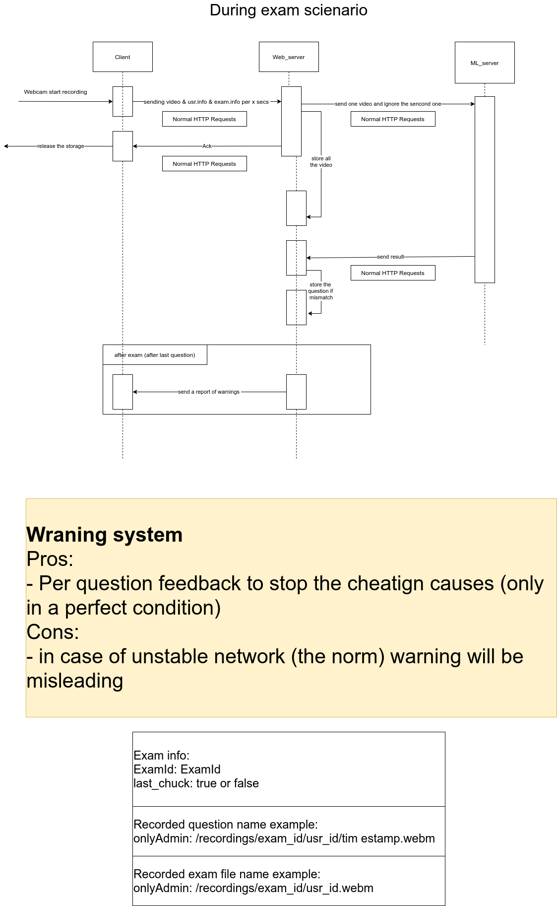
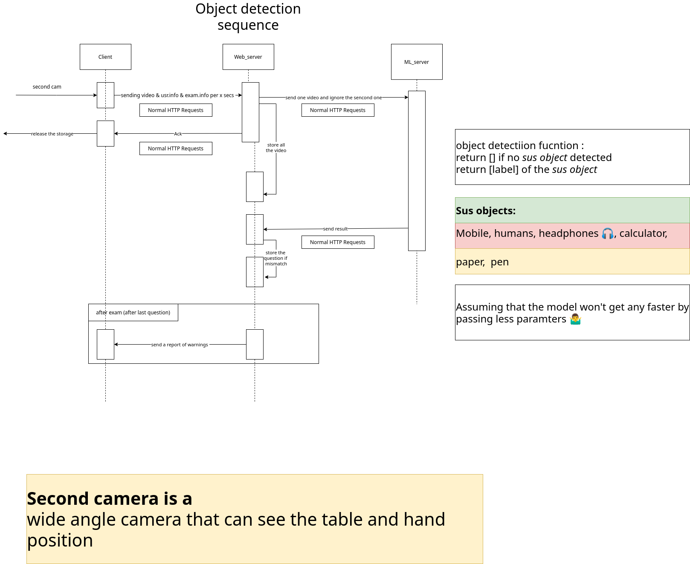

run janus locally with https

# instructions
- create a certificate [nginx/cert/README.md](https://github.com/Leon-OnlineLearning/leon-all/blob/main/nginx/cert/README.md)
- configure firewall to accept incoming connections at port `443`
- create `.env` file from `.env.docker` and add your secrets
- run npm install at `leon-ClientSide` & `Leon-ServerSide`
- run docker containers with `docker-compose up`
- make sure volumes in compose exist for folders and files
- download [models](face_verification/model.txt) and move them to `face_verfication/exam`

# Design
## During exam sequence

## Object detection sequence

# audio
[audio_work](audio_work.md)