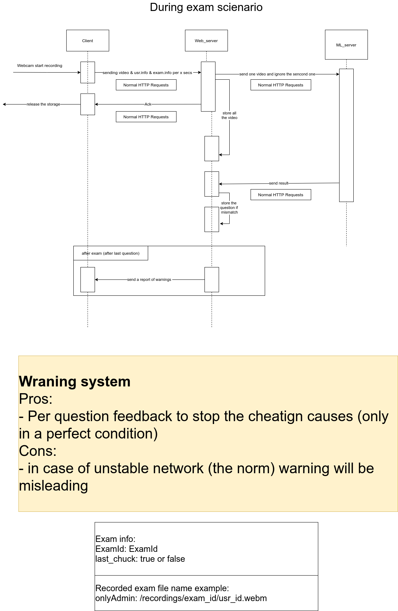

# LEON E-learning and online Examination platform
a platform for online learning focused in examination and lecture

## Getting started

### Running instructions
- create a certificate [nginx/cert/README.md](https://github.com/Leon-OnlineLearning/leon-all/blob/main/nginx/cert/README.md)
- configure firewall to accept incoming connections at port `443`
- create `.env` file from `.env.docker` and add your secrets
- run npm install at `leon-ClientSide` & `Leon-ServerSide`
- run docker containers with `docker-compose up`
- make sure volumes in compose exist for folders and files
- download [models](face_verification/model.txt) and move them to `face_verfication/exam`

### Testing 
Check the testing instruction in each repo

## book
the printed version of the book , contain documentation for other serveces [download_pdf](https://github.com/Leon-OnlineLearning/BOOK/releases/download/1.0.0/entry.pdf)
the latex verstion can be found in this [repo](https://github.com/Leon-OnlineLearning/BOOK)

## Design
### During exam sequence

## Object detection sequence


### audio
[audio_work](audio_work.md)


## known issues
### docker with windows
some type hyper-v take needed ports and prevent docker from starting and output the following error
```log
docker: error response from daemon: Ports are not available: listen tcp 0.0.0.0/xxxx: bind: An attempt was made to access a socket in a way forbidden by its access permissions.
```
to solve it check this solution [solution](fix_docker_ports.md)
